# Focus sequencing module

## Purpose

*Focus sequencing* is a [Magic Lantern](https://magiclantern.fm/) **module** helping to solve the following situations:

- We cannot use an external *focus puller monitor* because we're recording videos using **crop modes**, which are currently incompatible with the camera *HDMI output*
- We're recording videos as a **single camera operator** without the assistance of a *focus puller* and the sequence is too complex to deal with *manual focusing*

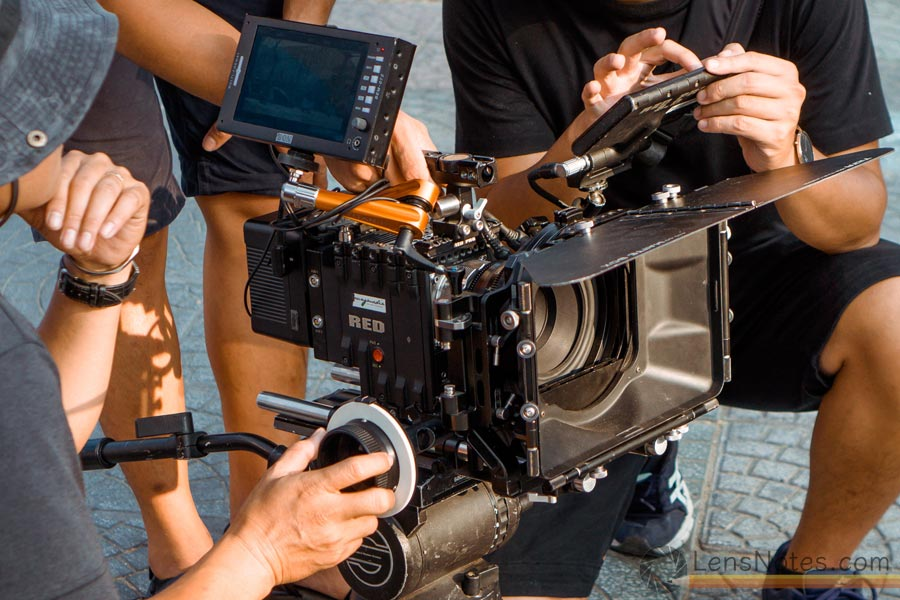

👉 *focus sequencing* provides then a way to easily **record multiple lens focus points**, so we can prepare a sequence including camera or target movements and subsequently **replay** them as we're recording videos, using a simple push button to switch to a point to the next one in the sequence.

> **Typical use case**: I'm a *single camera operator* recording a video using *crop modes* and my sequence is a combination of a *dolly-in* movement (with a speed ramp) and a horizontal camera rotation used to keep an object at the center of the composition.
>
> 👉 While I'm rehearsing the camera track and movements, I'll record three or four intermediate focus points in a sequence with proper speed transition settings, so my targeted object is always perfectly focused and I'll replay the focus sequence while I'm finally recording the scene, going forward from a focus point to the next one by pushing a single button.

## Video demonstration

[](https://www.youtube.com/watch?v=P4l6_LKDNcY)

## Technical issues and workarounds

We can already jump to the *how to use* / *how to install* chapters if we prefer, this chapter providing **technical insights** to detail *how* it works, giving also explanations about the purpose of the **lens calibration process**.

### State of the art

Imagine we want to play around focus points with a given camera lens, using *Magic Lantern* we can see that:

- we can move the lens programmatically, using the ***lens_focus*** function available in *lens.c*

  > to do so we basically ask the camera to do a lens rotation of given **step size**, that can be 1, 2 or 3, *positive* or *negative* to move the rotor *forward* or *backward*

- the lens is able to report **raw lens positions**

- the lens is able to report **focus distances** (in cm)

### Issue with Magic Lantern

The first issue to solve is related to the *lens_focus* function itself and its link to the reported *raw lens position* and *focus distance*, that are accessible by reading values in the exposed *lens_info* structure:

When moving the lens - if we ask to do so (using the *wait* parameter) - we expect naturally the function to **wait** after the move until the values become readable, but in practice it's **barely the case** as there's a potential delay between the lens rotation *confirmation flag* set by the camera (basically just indicating if the *rotation is ok* or if *something went wrong* during the move - like *reaching the lens limits*) and the update of the *lens_info* structure content itself, that may require multiple updates calls before being properly ***stabilized***, particularly when dealing with *step sizes* of 2 and 3.

This is very problematic as the *lens_focus* method become unreliable when we expect to correlate a lens move rotation query with a lens positioning feedback.

To solve this issue, a new ***lens_focus_ex*** function was added in *lens.c* (hence the specific *ML build*) with a clearer API (number of passes in the rotation *loop*, *step size* value, lens rotation direction - *forward* or *backward*) including a ***wait for feedback*** explicit and **reliable** flag that guarantee both the *raw lens positions* and *focus distances* values in the *lens_info* structure will be fully stabilized and readable after the call.

### Issue with lens specificities

Now, let's consider one specific camera lens for our tests: the **Canon EF 24mm f/2.8 IS USM**.

First of all, by reaching the extreme first rotation position of the lens then moving it *step by step* using our new *lens_focus_ex* function, we can report we got **407 mechanical steps** between the limits.

> - ❌ this number is specific to the lens
> - ✅ the step progression is obviously **increasing** and **linear**

👉 We need to **evaluate the mechanical steps** for each lens.

For each step, we can now report the corresponding **raw lens position** values by reading the *lens_info* structure after each function call:

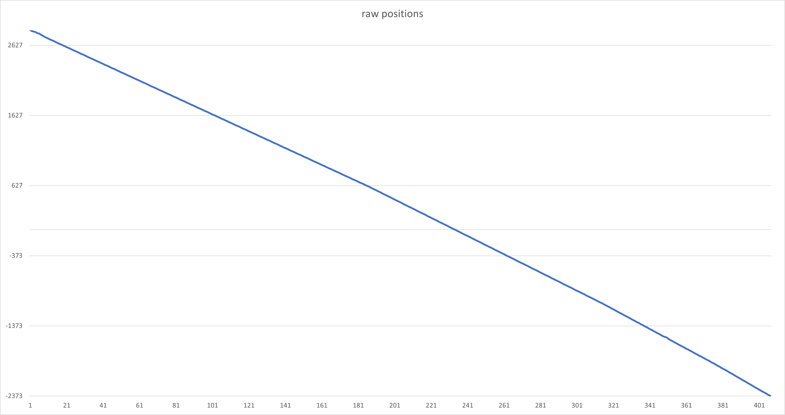

> These *raw lens positions* are:
> - ✅ **precise** enough: one specific value per mechanical step
> - ❌ **not absolute**: depends on the lens position at camera startup (e.g.: [2841,-2373] value range)
> - ❌ increasing or decreasing, but **not following a linear progression** (more obvious when using a logarithmic scale)
> - ❌ **not necessarily progressing forward** regarding mechanical step progression (e.g.: *inverted* here)

And also the corresponding **reported focus distances** in cm:

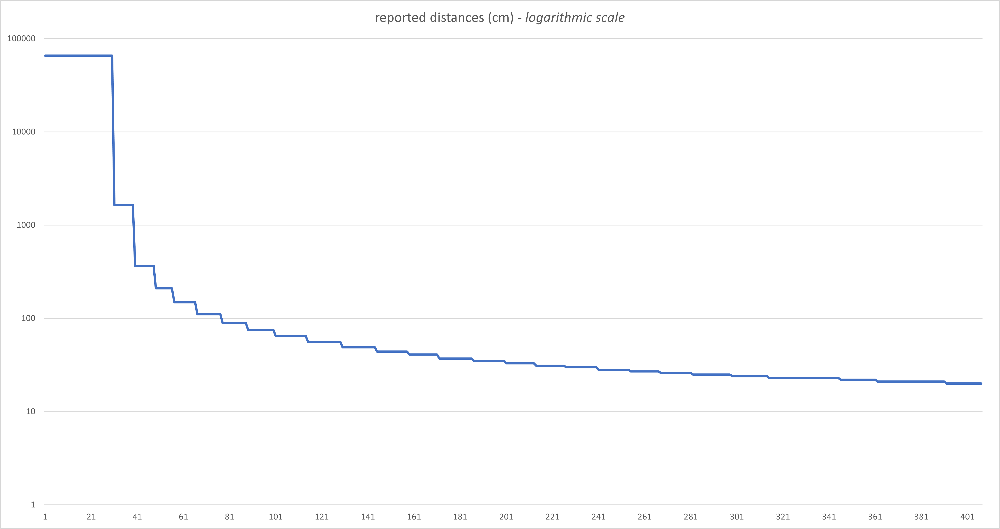

> These *focus distances* being:
> - ❌ **not precise** at all, with the same value reported for ~10 mechanical steps
> - ✅ **absolutes**: with always the same range (e.g.: [1647,20] value range here, 65535 meaning *infinite focus*)
> - ❌ increasing or decreasing, but **not following a linear progression**
> - ❌ **not necessarily progressing forward** regarding mechanical step progression (e.g.: inverted here)

👉 We need then to systematically determine the **minimal and maximal *raw lens positions* values** and **progression sign**, so we can compute corresponding **normalized lens positions**:

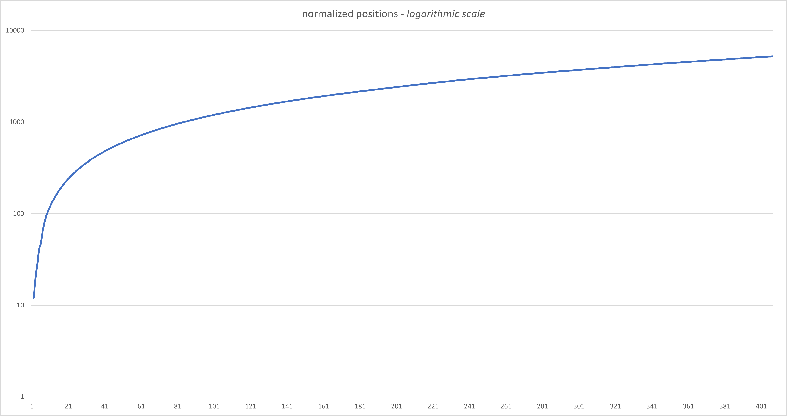

> These *normalized lens positions* being:
> - ✅ **precise** enough: one specific value per mechanical step
> - ✅ **absolutes**: with always the same value range (e.g.: [0,5214] value range here)
> - ❌ increasing or decreasing, but **not following a linear progression**
> - ✅ **progressing forward**

👉 We can save the result of the **lens calibration** process performed when we detect a new lens, that will include the **specific number of mechanical steps** and the corresponding **normalized lens position** for each step.

When restarting the camera, if the lens doesn't change, we can reload this calibration result and just determine the current **minimal and maximal *raw lens positions* values** which is potentially specific for each run, so we may be able to use the result of an **autofocus operation** by computing the corresponding **normalized lens position**.

Each focus points being systematically stored using *normalized lens positions*, we just have to determine the ✅ **closest mechanical step positions** corresponding to the *source* and *destination* *normalized lens values* then we can move the lens rotor accordingly to go from a focus point to the other.

The *focus distances* being always absolute, we can display it indicatively (because of the precision issue).

### Issue with *step size* lens rotation *steps*

This work perfectly when only moving the lens rotor using **step sizes of 1**, but when using a **step size of 2** and **3** we can see the **effective rotor lens step** performed by the camera are respectively of **4** and **26 steps** (averaged).

> ❌ the correlation between the *step size* value and the effective rotor *lens step* **is not linear** and specific per lens (and camera?)

### Issue with *step size* lens rotation *speeds*

The same issue occurs when checking the related speeds per queried *step sizes*:

- a lens *step size* of **1** will be executed at an average speed of **23.496 steps/s**
- a lens *step size* of **2** will be executed at an average speed of **48.733 steps/s**
- a lens *step size* of **3** will be executed at an average speed of **94.321 steps/s**

> ❌ the correlation between the *step size* value and the effective *lens rotation speed* **is not linear** and specific per lens (and camera?)

👉 We need then to evaluate both averaged **effective rotor lens step** and **rotation speed** for each possible ***step size*** value.

When doing a *lens focus transition* operation using a target duration, we can now compute a proper ✅ **distribution of the different *step size* and *wait calls*** so we may **reach *exactly* the target position** with a **duration *as close as possible* as queried** by the user using the **smoothest focus transition** possible, by taking in account both the *effective rotor lens* stepping and the *step size speeds*.

## How to install

Because we rely over a specific *lens_focus* function, there's currently no way to use this module outside specific builds that are including this function.

Our best shot is then to use one specific ***crop_rec_4k_mlv_snd_isogain_1x3_presets_ultrafast_fsq*** *Magic Lantern* build [available in my personal repository](https://github.com/arnaud-sintes/magiclantern_asintes/releases), which is basically an up-to-date fork of *Danne*'s one (with also the *[ultrafast framed preview](https://www.magiclantern.fm/forum/index.php?topic=26998)* feature).

Using this build, the ***focus_sq*** module is simply **embedded and activated by default**.

## How to use

### Starting focus sequencing

First of all, we need to start the ***focus sequencing* task**, just using the dedicated option available in the *Magic Lantern*'s **Focus** menu:

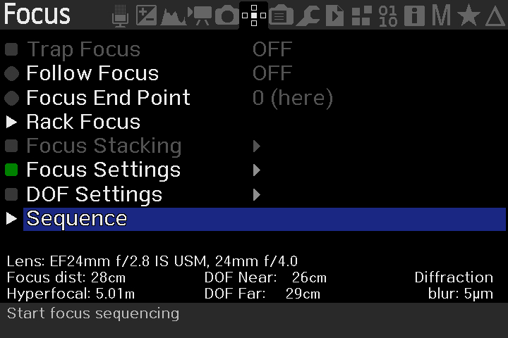

When started, we may see the following overlay in *LiveView*:

```
[    ]
```

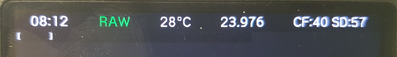

<font size=2>*I promise I will cleanup my screen the next time, hackers got now a nice fingerprint...*</font>

It means the *focus sequencing* task is running, the sequencing being currently **deactivated**.

To activate it, we need to use the <font style="background-color:blue; color: white">**[INFO]**</font> push button of the camera, allowing to switch from a "*deactivated*" state to the "***edit mode***".

> Focus sequencing LV overlays will be automatically hidden (and related key mapping deactivated) when going inside the ML menus.

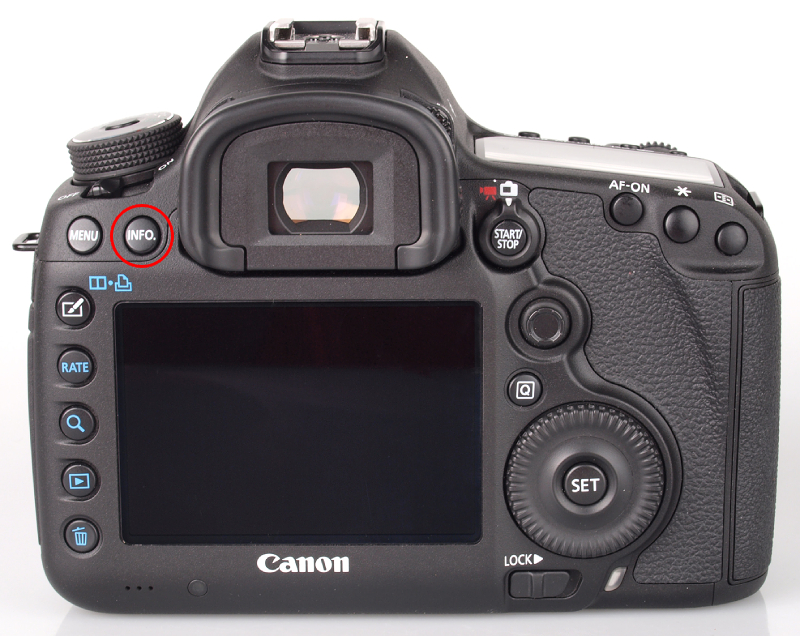

> The <font style="background-color:blue; color: white">**[INFO]**</font> button will loop between "*deactivated*", "*edit mode*" and "*play mode*".

### Calibration process

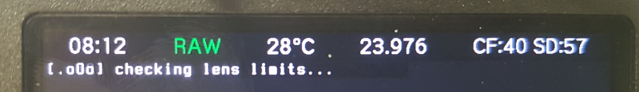

<font size=2>*Just because ASCII art animation is fun!*</font>

The first time we're switching to "**edit mode**", we may face two complementary situations:

* It's the **first time since the camera was started** we're accessing *focus sequencing*, then the program will run a short **lens limits checking process**.

  During the lens limits checking process, we may see the following overlay in *LiveView*:

  ```
  [.oOo] checking lens limits...
  ```

  The animated header indicating we need to wait for the end of the process.

  **Checking lens limits** is performing **two fast rotations** of the lens (*forward* then *backward*) in order to determine the **number of steps**, the current minimum relative *lens focus position* and deduce the **rotation direction**.

- It's the first time we're running *focus sequencing* with an **unknown lens**, then the program will run a whole **lens calibration process**.

  During the lens calibration process, we may see the following overlay in *LiveView*:

  ```
  [oOo.] calibrating lens...
  ```

  The animated header indicating we need to wait for the end of the process.

  **Calibrating lens** is performing the following operations:

  - a complete step by step (***slow***) ***forward*** rotation of the lens, in order to index the **normalized focus positions**
  - a partial very ***fast*** ***backward*** rotation of the lens, then a partial ***medium*** speed ***backward*** rotation, in order to compute the **average step size** for *stepping 2 and 3*
  - a partial ***slow backward*** rotation finishing the move, in order to compute the ***step size speed*** with a *stepping of 1*
  - a complete ***medium*** speed ***forward*** rotation, in order to compute the ***step size speed*** with a *stepping of 2*
  - a complete ***fast backward*** rotation, in order to compute the ***step size speed*** with a *stepping of 3*

The lens calibration result is then **saved on disk**, this is why we don't need to redo it until we're using another lens, while the *lens limits checking* process must be done for each camera run, the relative position of the lens being dependent of its position at startup.

Once these two processes were done (instant switch if already performed), the focus sequencing module will switch into "**edit mode**".

### Edit mode

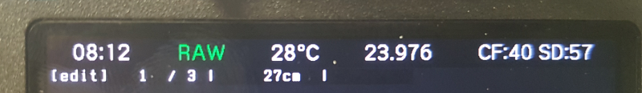

Edit mode is indicated by a **[edit]** header, followed by focus sequence information depending of the context:

```
[edit]   1 / 1 |    inf.   |
```

This display, common between "edit" and "play" modes, is split in four parts:

- an *header* indicating the current focus sequence **mode** (*edit* or *play*)
- the current focus point **index** in the sequence and the **sequence length**
- the **focus distance** (can be displayed in *centimeters*, *meters* or being *infinite*)
- the **transition duration** in second (not available on the first sequence focus point)

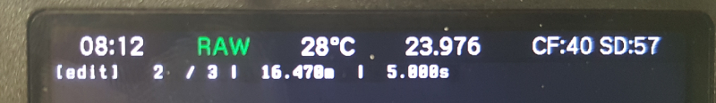

<font size=2>*The image above show we're currently editing the second focus point in a sequence of three elements, the focus point distance being 16.470m and the transition duration from previous point being of 5 seconds*</font>

With this mode, we can **setup** and **edit** a whole sequence of focus point, using the following camera triggers:

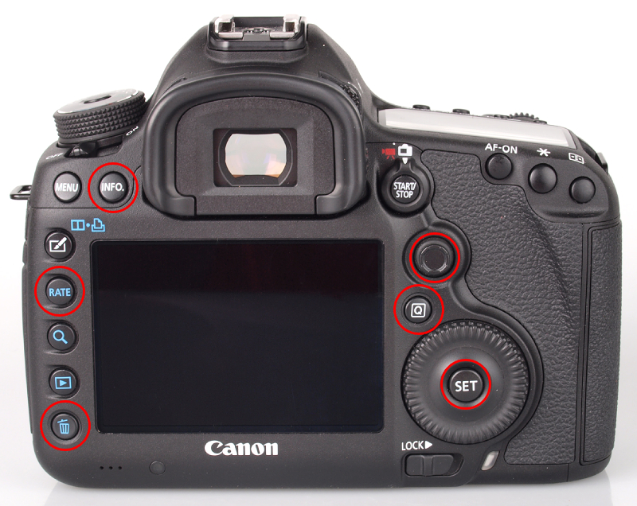

- <font style="background-color:blue; color: white">**[INFO]**</font> button to switch from "*edit mode*" to "*play mode*" (*highlight* to show the change)

- <font style="background-color:blue; color: white">**[RATE]**</font> toggle between LV display on/off (battery saver...)

  

- <font style="background-color:blue; color: white">**[HALF-SHUTTER]**</font> (*or any autofocus related button, depending of our ML key mapping*) button to **do an autofocus operation**, the **focus distance** value of the current focus point in the sequence being continuously ***highlighted*** with the current distance to display a difference exists with the registered value:

  ```
  [edit]   1 / 1 | {16.470m} |
  ```

- <font style="background-color:blue; color: white">**[SET]**</font> button to **register the current focus distance** as the property of the current focus point in the sequence, this operation being following by a quick ***highlight***:

  ```
  [edit]   1 / 1 | >16.470m< |
  ```

- <font style="background-color:blue; color: white">**[Q]**</font> button to **add a focus sequence point** right after the current one, using the current focus distance value.

  By default, the transition duration with the previous point is always computed to be the fastest physically possible:

  ```
  [edit] > 2</ 2 |     54cm  |  1.243s
  ```

- <font style="background-color:blue; color: white">**[TRASH]**</font> button to **remove the current focus point** in the sequence

- <font style="background-color:blue; color: white">**[UP]**</font> & <font style="background-color:blue; color: white">**[DOWN]**</font> buttons to **increase or decrease** the transition duration value, showing the **target value** during the ***highlight***:

  ```
  [edit]   2 / 2 |     54cm  | >1.300s<
  ```

  > This *target* value **may be different** of the one displayed after the highlight, showing then the **expected duration** computed by regarding the physical limitations of the lens rotation (see later)

- <font style="background-color:blue; color: white">**[LEFT]**</font> & <font style="background-color:blue; color: white">**[RIGHT]**</font> buttons to **navigate between the focus points** (loop on first & last), applying the fastest possible transition

When transitioning from a point to the other one, the display switch in the following intermediate state:

```
[edit] ==>( 2) | (   78cm) | (0.800s)
```

an animation showing we're moving to a destination point, the distance being the real-time updated lens focus distance and the duration being then a countdown to zero starting from the expected transition duration (*as fast as possible*, in this case).

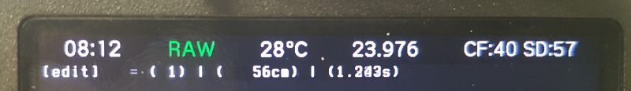

### Duration and distribution

As explained quickly before, every focus point in the sequence (except the 1st one) got a **transition duration** value indicating the time (second) used to go from a lens focus position to the next one.

The user set a **target duration**, meaning the duration he's expecting to do the transition, but because of the physical lens rotation limitations, an algorithm will try to compute the **closest expected duration**: our lenses can rotate using **three different *step size* values** (*1, 2 & 3*), these three values producing non-linear physical lens step rotation (e.g.: *1*, *4* and *26 steps*, respectively) at three different rotation speed rate... the algorithm will then try to **distribute** the different possible step size values so we're ***theoretically* reaching exactly the expected lens position** (e.g.: going from focus lens position 1 to 2 in the sequence) with a duration **as close as possible** as the user target value.

This is why sometimes we will see a "stagnating" expected duration value in the UI, event when decreasing the target value: it generally means it's ***not possible to go faster***.

In order to help, the default value computed when adding a new point in the sequence is the **fastest transition duration value possible**, this is why it's better to first change the focus distance value (using *autofocus*) then to add a new point in the sequence.

### Play mode

When hitting the <font style="background-color:blue; color: white">**[INFO]**</font> button in "*edit*" mode, we're switching to the "***play***" mode.

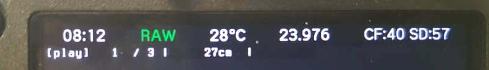

Play mode is indicated by a **[play]** header, followed by focus sequence information depending of the context:

```
[play]   1 / 1 |    inf.   |
```

This display of this overlay obey to the exact same rules as for the *edit* mode.

Using *play* mode, we can now **replay the focus point sequence** by simply run from a focus point to the next one, **using a single push button**.

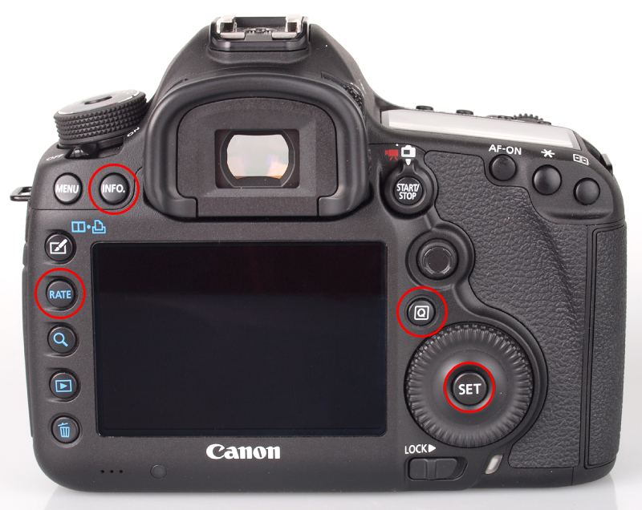

- <font style="background-color:blue; color: white">**[INFO]**</font> button to switch from "*play mode*" to "*inactive*" (*highlight* to show the change)
- <font style="background-color:blue; color: white">**[RATE]**</font> toggle between LV display on/off (battery saver...)


- <font style="background-color:blue; color: white">**[SET]**</font> button to **go from the current point in the sequence to the next one**, following the registered transition duration.

  When transitioning from a point to the other one, the display switch in the following intermediate state:

  ```
  [play] ==>( 2) | (   78cm) | (0.800s)
  ```

  an animation showing we're moving to a destination point, the distance being the real-time updated lens focus distance and the duration being then a **countdown to zero** starting from the expected transition duration.

  

  When the transition is done, we're just displaying the information of the current focus point: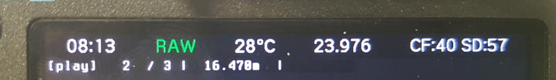

- <font style="background-color:blue; color: white">**[Q]**</font> button will **return to the first focus position** in the sequence, *as fast as possible*

Of course, the **play mode** is designed to be used **during video recording** (*background task*).

### Transition and distribution

We've seen before that an algorithm already computed the proper ***step size* distribution** to perform the transition from a point to another, when doing the move, the replay algorithm performs on its side another **distribution** of the different *step size* orders to execute (alongside potential *sleep* statements) so the movement between the two focus position is visually **as smooth as possible** (no visible *acceleration* nor *deceleration*).

Note also a check is performed after the movement to **ensure we exactly reached the expected position**, with a potential fix of the missing steps in all directions.

> A console log is dumped after the move to show the position deviation (after and before correction) and also the duration deviation (between the expected and the real duration).

### Settings file

As explained before, the **lens calibration** result is stored in a specific settings file, which is also the case for the **edited sequence** itself, including focus positions and transition durations.

It means we can safely shutdown the camera and we will retrieve our whole focus sequence definition, being usable to reply it properly (after an initial *lens limits checking process*).

This settings file is saved and loaded from the following path:

```
ML/SETTINGS/focus_sq.cfg
```

## License and credits

The *focus sequencing* module for *Magic Lantern* is provided under the [GPLv3 licensing model](https://www.gnu.org/licenses/gpl-3.0.en.html).

Thanks to *`WalterSchulz`* & *`?❄? names_are_hard ?❄?`* for the support!
